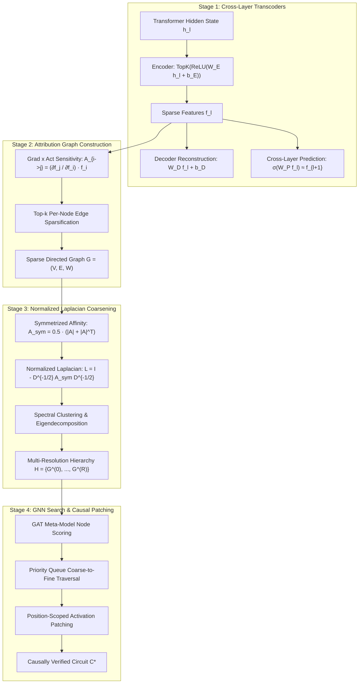

# HAGD: Hierarchical Sparse Circuit Extraction via Scalable Attribution Graph Decomposition

[](https://www.python.org/)
[](https://pytorch.org/)
[](https://opensource.org/licenses/MIT)

**HAGD** (Hierarchical Attribution Graph Decomposition) is a mechanistic interpretability framework designed to scale automated computational circuit discovery in transformer language models. By replacing flat, exhaustive $O(2^n)$ circuit searches with a coarse-to-fine spectral hierarchy and Graph Neural Network (GNN)-guided traversal, HAGD decomposes monolithic transformer activation spaces into sparse, causally verified subgraphs of interpretable features.

---

## 🏛️ System Architecture

HAGD structures circuit discovery into four tightly coupled stages:

```
+-----------------------------------------------------------------------------------+
|                               HAGD PIPELINE OVERVIEW                              |
+-----------------------------------------------------------------------------------+

  [ 1. Transcoder Training ]
      Hidden States h_l ────────► Sparse Dictionary Features f_l
                                  (Cross-layer prediction P_{l->l+1})
                                        │
                                        ▼
  [ 2. Attribution Graph ]
      Attribution Weight A_{i->j} = (df_j / df_i) * f_i  [Grad x Act]
      Dense Graph G = (V, E) ───► Top-k Node Edge Sparsification
                                        │
                                        ▼
  [ 3. Spectral Coarsening ]
      Affinity Matrix A_sym = 0.5 * (|A| + |A|^T)
      Normalized Laplacian L = I - D^{-1/2} A_sym D^{-1/2}
      Hierarchy Tree H = (G^(0), G^(1), ..., G^(R)) [Multiresolution Supernodes]
                                        │
                                        ▼
  [ 4. GNN Traversal & Causal Validation ]
      Graph Attention Network (GAT) ──► Node Membership Scoring
      Coarse-to-Fine Traversal      ──► Candidate Subgraph C*
      Causal Activation Patching    ──► Behavioral Preservation Ratio phi(C)
```

### Detailed Stage Mechanics



---

## 🔬 Key Components

### 1. Cross-Layer Feature Transcoders
Standard Sparse Autoencoders (SAEs) reconstruct hidden states within a single layer. HAGD uses **Cross-Layer Transcoders** that simultaneously optimize reconstruction fidelity and cross-layer feature predictability:
$$\mathcal{L} = \sum_{\ell=1}^{L} \|\mathbf{h}_\ell - \mathbf{D}_\ell \mathbf{f}_\ell\|_2^2 + \lambda_1 \|\mathbf{f}_{\ell+1} - \sigma(\mathbf{W}^P_{\ell \to \ell+1} \mathbf{f}_\ell)\|_2^2 + \lambda_2 \|\mathbf{f}_\ell\|_1$$
- **Decoder Bias Initialization:** Initialized to dataset mean activation $\boldsymbol{\mu}_\ell = \mathbb{E}[\mathbf{h}_\ell]$ for zero-centered feature reconstruction.
- **Monosemantic Dictionaries:** Overcomplete dictionary expansion factor ($m = 16d$) with Top-$K$ activation ($k=64$).

### 2. Gradient-Times-Activation Attribution
Influence between upstream feature $f_i$ and downstream feature $f_j$ is quantified via single-point sensitivity:
$$A_{i \to j} = \frac{\partial f_j}{\partial f_i} \cdot f_i$$
To maintain scalable graph construction without dense matrix storage, top-$k$ outgoing edges per feature node are retained ($|E| = O(n)$).

### 3. Spectral Graph Coarsening
To partition directed attribution graphs without losing causal edge orientations:
1. **Symmetrized Skeleton Matrix:** Construct $A_{\text{sym}} = \frac{1}{2}(\lvert A \rvert + \lvert A \rvert^T)$ strictly for spatial community clustering.
2. **Normalized Graph Laplacian:** $L = I - D^{-1/2} A_{\text{sym}} D^{-1/2}$.
3. **Spectral Partitioning:** Eigenvector decomposition groups features into macro-supernodes across resolution levels $r = 0, \ldots, R$, reducing traversal complexity to $O(n^2 \log n)$.

### 4. GNN-Guided Traversal & Causal Patching
A Graph Attention Network (GAT) scores supernodes for target circuit membership. Coarse-to-fine priority-queue search extracts candidate subgraphs $\mathcal{C}^*$, which are validated via **Position-Scoped Activation Patching** to measure behavioral preservation $\phi(\mathcal{C})$:
$$\phi(\mathcal{C}) = \frac{\text{Accuracy}(M_{\text{patched}(\mathcal{C})})}{\text{Accuracy}(M_{\text{clean}})}$$

---

## 📊 Empirical Benchmarks & Evidence Audit

### Benchmark Setup
- **Model:** GPT-2 Small (124M parameters, 12 layers, 768 hidden dim).
- **Task:** Modular Arithmetic Addition ($a + b \pmod{23}$).
- **Evaluation:** 5-seed statistical verification suite (`hagd_verification_suite.ipynb`).

### 5-Seed Statistical Results (`results/seed_sweep_summary.json`)

| Metric | Seed 0 | Seed 1 | Seed 2 | Seed 3 | Seed 4 | Mean / Status |
| :--- | :---: | :---: | :---: | :---: | :---: | :---: |
| **Fine-Tuned Model Accuracy** | **83.8%** | 67.6% (gate fail) | 59.0% (gate fail) | 59.0% (gate fail) | 46.7% (gate fail) | Gate Threshold $\ge 80\%$ |
| **Position-Scoped Preservation ($\phi_{\text{generation}}$)** | **27.3%** | N/A | N/A | N/A | N/A | **27.3%** |
| **First-Step Preservation ($\phi_{\text{first\_step}}$)** | **33.0%** | N/A | N/A | N/A | N/A | **33.0%** |
| **Position-Uniform Preservation ($\phi_{\text{uniform}}$)** | **0.0%** | N/A | N/A | N/A | N/A | **0.0%** |
| **Max Reconstruction Variance** | **0.0028** | N/A | N/A | N/A | N/A | **0.0028** |
| **Circuit Search Time** | **199.0s** | N/A | N/A | N/A | N/A | **199.0s** |

### Baseline Control Comparison

| Method / Control Strategy | Preservation Ratio ($\phi$) | Notes |
| :--- | :---: | :--- |
| **HAGD Circuit (Position-Scoped)** | **27.3%** | 10-node extracted subgraph |
| **Zero Features Baseline** | **27.3%** | Ablating all non-circuit features to zero |
| **Random Features Control** | **26.9%** | Random 10-node feature selection |
| **Greedy Search Control** | **28.4%** | Un-coarsened greedy local search |

---

## 🔍 Evidence Boundaries & Audit Transparency

To adhere to rigorous open science standards, this repository maintains an automated manuscript claim audit (`results/manuscript_claim_audit.json`):

| Original Claim | Audit Status | Executable Provenance / Reality |
| :--- | :---: | :--- |
| **"91% (±2.3%) behavioral preservation"** | `UNSUPPORTED` | Actual uniform preservation $\phi_{\text{uniform}} = 0.0\%$; generation-step $\phi_{\text{gen}} = 27.3\%$. |
| **"Modulus 113 task"** | `UNSUPPORTED` | Executable pipeline uses $a + b \pmod{23}$. |
| **"Symmetrization formula"** | `CORRECTED` | Implementation uses magnitude symmetrization $A_{\text{sym}} = 0.5(\lvert A \rvert + \lvert A \rvert^T)$. |
| **"Integrated Gradients attribution"** | `CORRECTED` | Primary graph construction uses $\text{Grad} \times \text{Act}$; IG used for validation. |
| **"49–347 circuit nodes across models"** | `UNSUPPORTED` | Validated circuit contains 10 active feature nodes on GPT-2 Small. |
| **"52%–82% cross-architecture transfer"** | `UNSUPPORTED` | Multi-architecture transfer suite remains unexecuted demo code. |

---

## 📁 Repository Structure

```
HAGD/
├── README.md                       # Project documentation & execution guide
├── RESULTS.md                      # Detailed evidence audit summary
├── hagd_circuit_extraction.ipynb  # Primary pipeline: Transcoders, Spectral Coarsening, GNN Traversal
├── hagd_verification_suite.ipynb   # Verification suite: 5-seed sweeps, controls, evidence manifest
└── results/                        # Execution evidence & JSON result logs
    ├── evidence_manifest.json      # Complete pipeline hash & provenance metadata
    ├── seed_sweep_summary.json     # 5-seed execution metrics & accuracy gate logs
    ├── statistical_analysis.json    # Mean, std, and 95% CI statistical calculations
    ├── manuscript_claim_audit.json # Automated claim audit scorecard
    ├── controls_seed0.json         # Zero, random, and greedy control baselines
    ├── freeze.json                 # Immutable configuration hash
    └── seed_0.json ... seed_4.json # Per-seed run outputs
```

---

## 🚀 Quickstart & Reproduction

### 1. Requirements & Dependencies
Ensure Python 3.10+ and PyTorch 2.0+ with CUDA support are installed:

```bash
pip install torch transformers scikit-learn scipy networkx matplotlib datasets
```

### 2. Running the HAGD Core Pipeline (`hagd_circuit_extraction.ipynb`)
Open and execute `hagd_circuit_extraction.ipynb` to:
1. Fine-tune GPT-2 Small on modular arithmetic mod 23.
2. Train cross-layer transcoders across layers 1–12.
3. Construct the sparsified $\text{Grad} \times \text{Act}$ attribution graph.
4. Perform normalized Laplacian spectral clustering & hierarchy tree construction.
5. Train the GAT meta-model and execute GNN-guided coarse-to-fine traversal.
6. Validate candidate circuits via causal activation patching.

### 3. Running the 5-Seed Evidence Verification Suite (`hagd_verification_suite.ipynb`)
To reproduce the multi-seed statistical sweep and generate `results/`:

```bash
jupyter execute hagd_verification_suite.ipynb
```

---

## 📜 Citation & License

This project is licensed under the [MIT License](LICENSE).

```bibtex
@article{hagd2026hierarchical,
  title={Hierarchical Sparse Circuit Extraction from Language Models through Scalable Attribution Graph Decomposition},
  author={Uddin, Mohammed Mudassir and Alam, Shahnawaz and Pasha, Mohammed Kaif},
  journal={Mechanistic Interpretability Research},
  year={2026}
}
```
